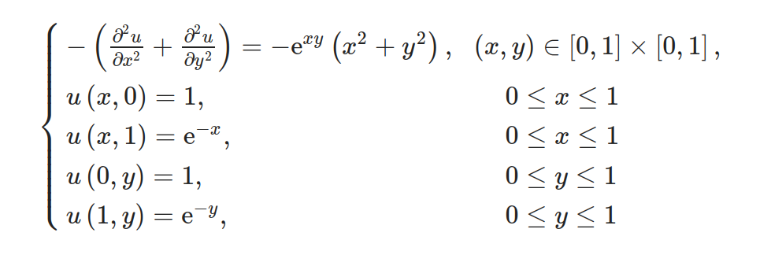

### Технические характеристики оборудования, на котором проводился эксперимент:

* CPU - AMD Ryzen 7 6800H 
* RAM - 16 GB @ 6400Mhz
* Операционная система - EndeavourOS
* Компилятор - gcc (GCC) 13.2.1 20230801


## Попытки оптимизация


<details>
<summary>Рассматриваемая функция. За начальную аппроксимацию берется ряд Тейлора до 2 порядка.</summary>
<a href="https://www.scirp.org/pdf/jamp_2021120811364802.pdf">Guo, P. (2021)</a>




</details>

Изначальные замеры при $`\varepsilon = 0.00001, \space \text{BLOCK{\_}SIZE} = 128`$, без дополнительных оптимизационных флагов компилятора.


<details>
<summary>Таблица 1</summary>

| Net size | Block size | Threads | Iterations | Mean time (s) | Standard dev. |
|----------|------------|---------|------------|---------------|---------------|
|      500 |        128 |      16 |        503 |      0.589981 |      0.012760 |
|      500 |        128 |       8 |        503 |      0.333363 |      0.003423 |
|      500 |        128 |       4 |        503 |      0.324685 |      0.002998 |
|      500 |        128 |       2 |        503 |      0.453506 |      0.002961 |
|      500 |        128 |       1 |        503 |      0.753704 |      0.010824 |
|     1000 |        128 |      16 |        114 |      0.245242 |      0.012208 |
|     1000 |        128 |       8 |        114 |      0.174217 |      0.005647 |
|     1000 |        128 |       4 |        114 |      0.258892 |      0.002761 |
|     1000 |        128 |       2 |        114 |      0.437918 |      0.013646 |
|     1000 |        128 |       1 |        114 |      0.694226 |      0.016042 |
|     2000 |        128 |      16 |        125 |      0.788747 |      0.061547 |
|     2000 |        128 |       8 |        125 |      0.676552 |      0.009790 |
|     2000 |        128 |       4 |        125 |      1.088881 |      0.014186 |
|     2000 |        128 |       2 |        125 |      1.870089 |      0.043061 |
|     2000 |        128 |       1 |        125 |      3.203640 |      0.051038 |
|     3000 |        128 |      16 |        127 |      1.688856 |      0.106316 |
|     3000 |        128 |       8 |        127 |      1.485434 |      0.013373 |
|     3000 |        128 |       4 |        127 |      2.550185 |      0.040144 |
|     3000 |        128 |       2 |        127 |      4.667408 |      0.055648 |
|     3000 |        128 |       1 |        127 |      8.041877 |      0.094429 |
|     5000 |        128 |      16 |        129 |      4.351258 |      0.095518 |
|     5000 |        128 |       8 |        129 |      4.611865 |      0.063269 |
|     5000 |        128 |       4 |        129 |      7.720493 |      0.050564 |
|     5000 |        128 |       2 |        129 |     13.548829 |      0.173516 |
|     5000 |        128 |       1 |        129 |     22.736535 |      0.154822 |
|     7000 |        128 |      16 |        130 |      8.468810 |      0.193349 |
|     7000 |        128 |       8 |        130 |      8.921923 |      0.083097 |
|     7000 |        128 |       4 |        130 |     14.755094 |      0.187483 |
|     7000 |        128 |       2 |        130 |     25.874556 |      0.223946 |
|     7000 |        128 |       1 |        130 |     47.151173 |      2.052297 |


</details>

Отсюда можно сразу увидеть, что:
* 16 потоков медленнее во всех случаях, чем 8. Можно сделать вывод, что, так как физических ядер 8, разделение ядра на логические потоки не дает прироста по производительности алгоритма.
* Стандартное отклонение на 16 потоках в среднем несколько раз больше чем на 8. Этому трудно найти объяснение, однако можно предположить, что причина тому context switching (?).

Были предприняты разные попытки ускорить имеющийся алгоритм, например, путем объявления одного параллельного региона вместо двух или редукцией по нахождению максимума. Однако это не давало никакого прироста по скорости работы алгоритма, а в некоторых случаях даже замедляло.


Компиляция с флагами `-O3 -march=native` позволила ускорить алгоритм в среднем в 1.335 раз.

<details>
<summary>Таблица 2</summary>

| Net size | Block size | Threads | Iterations | Mean time (s) | Standard dev. |
|----------|------------|---------|------------|---------------|---------------|
|      500 |        128 |      16 |        503 |      0.269982 |      0.040428 |
|      500 |        128 |       8 |        503 |      0.236516 |      0.002342 |
|      500 |        128 |       4 |        503 |      0.229929 |      0.000766 |
|      500 |        128 |       2 |        503 |      0.315525 |      0.002405 |
|      500 |        128 |       1 |        503 |      0.523016 |      0.003358 |
|     1000 |        128 |      16 |        114 |      0.151863 |      0.051533 |
|     1000 |        128 |       8 |        114 |      0.124306 |      0.002314 |
|     1000 |        128 |       4 |        114 |      0.179336 |      0.002751 |
|     1000 |        128 |       2 |        114 |      0.291005 |      0.003578 |
|     1000 |        128 |       1 |        114 |      0.478468 |      0.003444 |
|     2000 |        128 |      16 |        125 |      0.464755 |      0.061463 |
|     2000 |        128 |       8 |        125 |      0.483258 |      0.010143 |
|     2000 |        128 |       4 |        125 |      0.746310 |      0.001688 |
|     2000 |        128 |       2 |        125 |      1.317779 |      0.032687 |
|     2000 |        128 |       1 |        125 |      2.502585 |      0.142725 |
|     3000 |        128 |      16 |        127 |      1.215588 |      0.273402 |
|     3000 |        128 |       8 |        127 |      1.111818 |      0.013663 |
|     3000 |        128 |       4 |        127 |      1.858626 |      0.023030 |
|     3000 |        128 |       2 |        127 |      3.278733 |      0.062494 |
|     3000 |        128 |       1 |        127 |      5.797365 |      0.133256 |
|     5000 |        128 |      16 |        129 |      2.775138 |      0.225454 |
|     5000 |        128 |       8 |        129 |      3.548661 |      0.206839 |
|     5000 |        128 |       4 |        129 |      5.568831 |      0.107099 |
|     5000 |        128 |       2 |        129 |      9.592116 |      0.310033 |
|     5000 |        128 |       1 |        129 |     16.829833 |      0.470215 |
|     7000 |        128 |      16 |        130 |      8.334095 |      1.420886 |
|     7000 |        128 |       8 |        130 |      6.825994 |      0.177797 |
|     7000 |        128 |       4 |        130 |     10.888808 |      0.527275 |
|     7000 |        128 |       2 |        130 |     18.358476 |      0.136657 |
|     7000 |        128 |       1 |        130 |     32.781888 |      1.256233 |

</details>


## Матмоделирование (типа)
Давайте попытаемся построить некую модель, с помощью которой мы сможем "прикидывать" время выполнения программы (скажем, $T$) с разными переменными.  За переменные мы возьмем:

- $N$ - размер сетки
- $B$ - размер блока
- $NB$ - количество блоков вдоль 1 оси (это обозначение введено для удобства, в модели $NB$ будет выражено в виде $`ceil(\frac{N}{B})`$) 
- $P$ - количество ядер
- $\varepsilon$ - эпсилон

Сначала мы хотим смоделировать время работы одной итерации.

Пусть 
* $C, D$ - некий overhead.
* $a$ - некий параметр.

 Тогда:  

$$T_{iter} = a * \frac{(NB)^2 * B^2
}{min(P, NB) + D} + C$$

При попытки смоделировать $T$ встает задача выразить $I$ через наши переменные, что является нетривиальной задачей на первый взгляд, поэтому пока ограничимся $T_{iter}$. Но для начала сделаем несколько гипотез:
1. Время одной итерации при всех равных не зависит от выбранной функции.
2. Время одной итерации не зависит от количества итераций и/или $\varepsilon$.

За начальные данные возьмем такое декартово произведение $P_{data} \times N_{data}\times B_{data}$, где

* $P_{data}$ = $\{1,\ 2,\dots,\ 8\}$ - количество ядер; 

* $N_{data}$ - размер сетки, последовательность $a_n = 500 + 30n^{1.3}$ при $n \in 1..40$

* $B_{data}$ = $`\{16, \ 32, \  48, \  64, \  86,  \ 108, \ 128, \ 192, \ 256\}`$ - размер блоков; 

Воспользуемся `curve_fit` из библиотеки `scipy.optimize` для подбора параметров (для удобства переведём секунду в миллисекунды)

<details>
<summary>Код:</summary>

```python
from scipy.optimize import curve_fit
import numpy as np

def func(X, a, C, D):
  N, P, B = X
  NB = np.ceil(N/B)
  r = a * ((NB**2) * B**2)/(np.minimum(P, NB) + D) + C
  return r

N = txt_dict["Net size"]
P = txt_dict["Threads"]
B = txt_dict["Block size"]
T = txt_dict["MsPerIter"]

X = np.vstack((N, P, B))

popt, pcov = curve_fit(func, X, T, bounds = (0, 100))
popt
```
</details>

Получаем, что $$a = 3.39933509\times10^{-8}$$ $$C =-1.96834641\times10^{-2}$$ $$D = 4.88854156\times10^{-3}$$

На начальном датасете средняя относительная погрешность составила 14.55%.

## Заключение
 
Моделирование скорости работы параллельного алгоритма является сложной задачей, зависящей от многих нерасмотренных здесь переменных: cache hits, cache line, clock speed и т.д. Как было показано, грубая оценка производительности дает слишком грубую погрешность, однако она может быть полезна в приблизительной оценки выигрыша от параллельности. 

