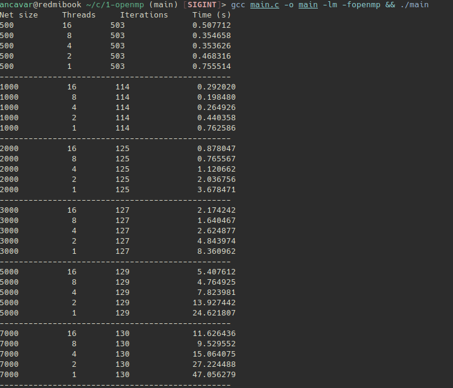
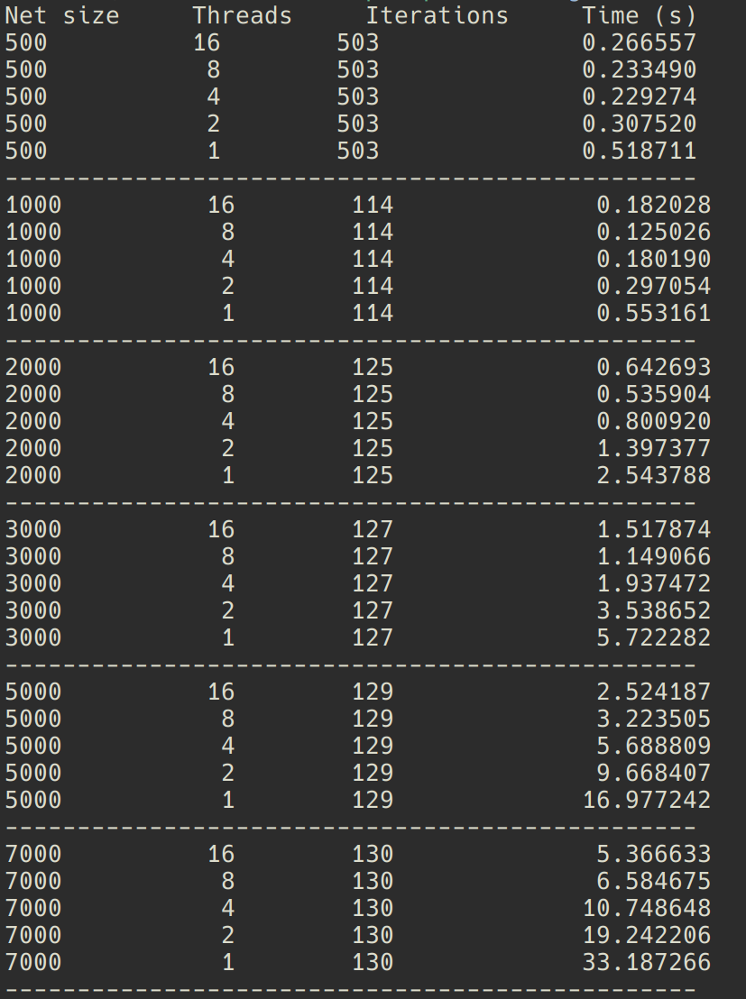

### Технические характеристики оборудования, на котором проводился эксперимент:

* CPU - AMD Ryzen 7 6800H 
* Операционная система - EndeavourOS
* Компилятор - gcc (GCC) 13.2.1 20230801


### Оптимизация


<details>
<summary>(Рассматриваемая функция. За начальную аппроксимацию берется ряд Тейлора до 2 порядка.)</summary>


</details>

Изначальные замеры при $\varepsilon = 0.00001, \space \text{BLOCK\_SIZE} = 128$ 

<details>
<summary>todo: сделать таблицу</summary>



</details>

Отсюда можно сразу увидеть, что 16 потоков медленнее во всех случаях, чем 8 (что, по сути, есть 8 ядер). 

Были предприняты разные попытки ускорить имеющийся алгоритм, например, путем объявления одного параллельного региона вместо двух или редукцией по нахождению максимума. Однако это не давало никакого прироста по скорости работы алгоритма, а в некоторых случаях даже замедляло.


Компиляция с флагами `-O3 -march=native` позволила ускорить
<details>
<summary>todo: сделать таблицу</summary>



</details>


### Матмоделирование (типа)
Давайте попытаемся построить некую модель, с помощью которой мы сможем "угадывать" время выполнения программы (скажем, $T$) с разными переменными. За переменные мы возьмем:

- $ N $ - размер сетки
- $ B $ - размер блока
- $ NB $ - количество блоков вдоль 1 оси (это обозначение введено для удобства, в модели $ NB $ будет выражено в виде $ceil (\frac{N}{B})$) 
- $ P $ - количество ядер
- $\varepsilon$ - эпсилон

Сначала мы, точно, хотим смоделировать время работы одной итерации.

Пусть 
* $C$ - некий overhead.
* $a$ - некий параметр.

 Тогда:  

$$T_{iter} = a * \frac{(NB)^2 * B^2
}{min(P, NB)} + C$$

При попытки смоделировать $T$ встает задача выразить $I$ через наши переменные, что является нетривиальной задачей на первый взгляд, поэтому пока ограничимся $T_{iter}$ .

За начальные данные возьмем такое декартово произведение $P_{data} \times N_{data}\times B_{data}$, где

* $P_{data}$ = $\{1,\ 2,\dots,\ 8\}$ - количество ядер; 

* $N_{data}$ - размер сетки, последовательность $a_n = 500 + 30n^{1.3}$ при $n \in 1..40$

* $B_{data}$ = $\{16, \ 32, \  48, \  64, \  86,  \ 108, \ 128, \ 192, \ 256\}$ - размер блоков; 

Воспользуемся `curve_fit` из библиотеки `scipy.optimize` для подбора параметров (для удобства переведём секунду в миллисекунды)

<details>
<summary>Код:</summary>

```python
from scipy.optimize import curve_fit
import numpy as np

def func(X, a, C):
  N, P, B = X
  NB = np.ceil(N/B)
  r = a * ((NB**2) * B**2)/(np.minimum(P, NB)) + C
  return r

N = txt_dict["Net_size"]
P = txt_dict["Threads"]
B = txt_dict["Block size"]
T = txt_dict["MsPerIter"]

X = np.vstack((N, P, B))

popt, pcov = curve_fit(func, X, T, bounds = (0, 100))
popt
```
</details>

Получаем, что $$a = 3.17028389\times10^{-9} \\ C =-8.98776265\times10^{-4}$$
Подставляя $N = 7000, \ T = \{1, \ 2, \ 4, \ 8\}, \ B = 128 $ и умножая на количество итераций (мы знаем его с самого первого примера):
```
8 6258.985565423468 
4 12216.704107242223
2 24132.141190879734 
1 47963.01535815476 
```
