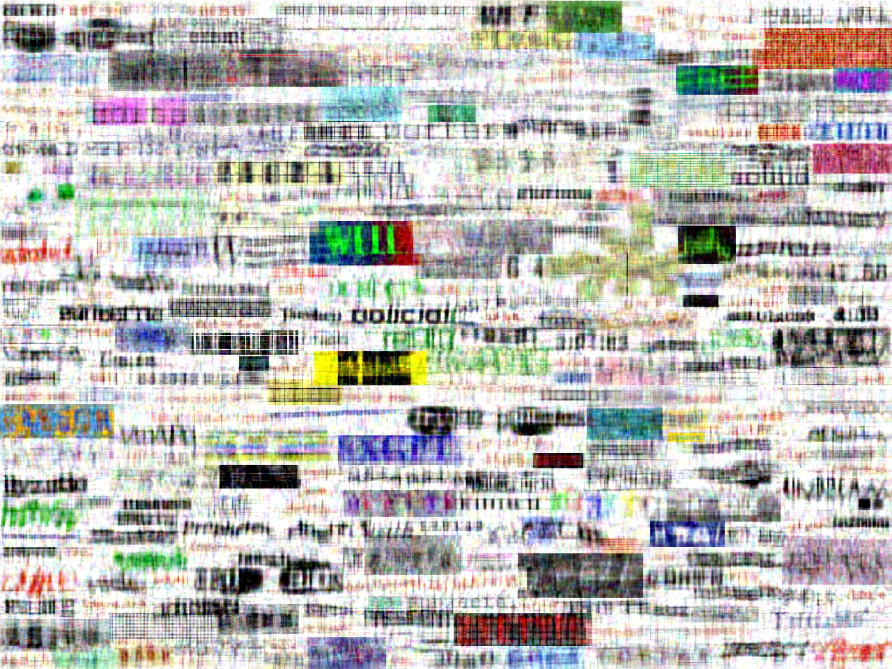
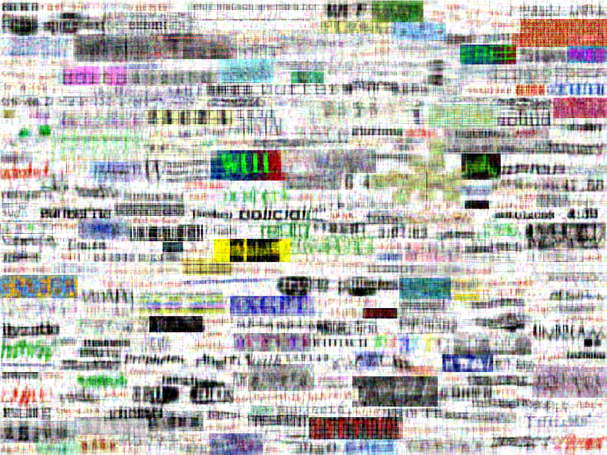
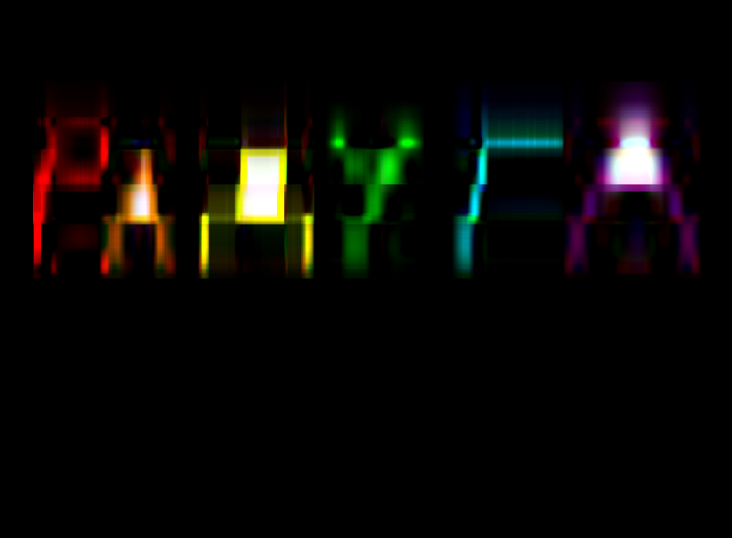
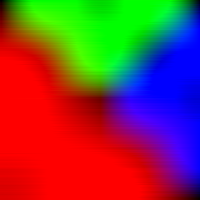

## Технические характеристики оборудования, на котором проводился эксперимент:

* CPU - AMD Ryzen 7 6800H
* RAM - 16 GB @ 6400Mhz
* Операционная система - EndeavourOS
* Python 3.11.8, numpy 1.26.4, linalg 1.0.4

## Эксперимент

### Алгоритмы:
* numpy - ```numpy.linalg.svd```
* simple (power method) - https://www.jeremykun.com/2016/05/16/singular-value-decomposition-part-2-theorem-proof-algorithm/
* advanced (randomized method) - https://gregorygundersen.com/blog/2019/01/17/randomized-svd/


| Алгоритм | Сжатие x2 | Время работы (сек.) |
| --- | --- | --- |
| numpy |  | 2 |
| simple |  | 3148
| advanced |  | 77 |


При внимательном изучении "разжатых" картинок заметных различий найдено не было. 


Рассмотрим картинку такую, что её матрица неплотная.


| Алгоритм | Сжатие x10 | Время работы (сек.) |
| --- | --- | --- |
| numpy |  | 0.14 |
| simple |  | 302 |
| advanced |  | 2.7 |

Однако и здесь не было замечено разницы между разными алгоритмами.

| Алгоритм | Сжатие x5 | Время работы (сек.) |
| --- | --- | --- |
| numpy |  | 0.02 |
| simple |  | 7.44 |
| advanced |  | 0.24 |

Здесь можно лишь заметить некоторую "рябь" на изображении, полученном с помощью рандомного алгоритма.