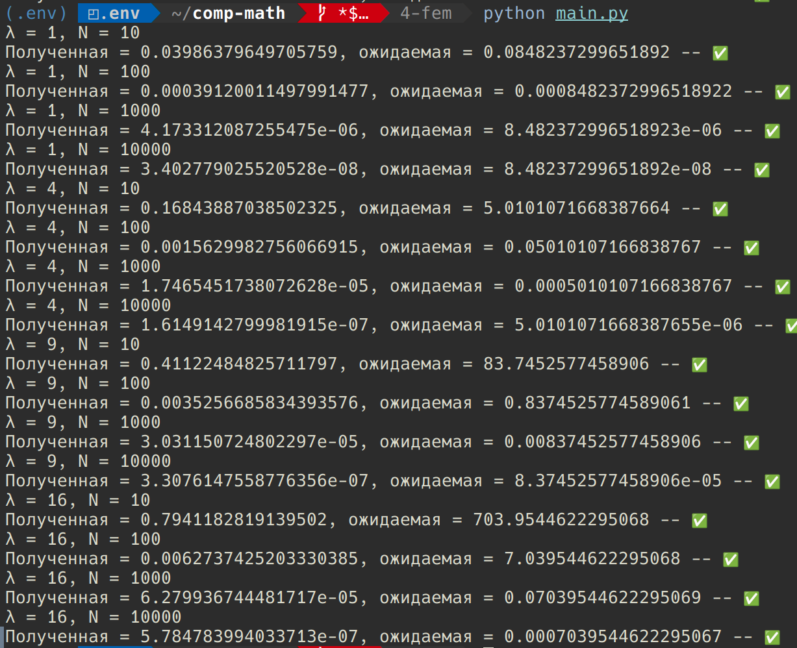

## Технические характеристики оборудования, на котором проводился эксперимент:

* CPU - AMD Ryzen 7 6800H
* RAM - 16 GB @ 6400Mhz
* Операционная система - EndeavourOS
* Python 3.11.8, numpy 1.26.4, linalg 1.0.4, scipy 1.13.1

## Эксперимент

Эксперимент проводился на равномерной сетке $[0, \ 2\pi]$и для него был выбран следующий диффур с $\lambda = n^2, \ \ n = 1, \ 2, \ 3\dots$: $$ y'' - \lambda y = -2\lambda\sin(\sqrt\lambda x) $$

И следующая оценка:

$$ \|y - y_h\|\_{L_2(0,l)} \leq (c'c)^2 h^2 \|f\|\_{L_2(0,l)} $$

где $$ c = \frac{1}{c_1} \left( \left( Q \frac{l}{2} + P_1 \right) \frac{l}{2c_1} + 1 \right) $$

где $c_1 = 20, \ \ Q = \lambda, \ \ P_1 = 0$

Тогда

Более подробно

